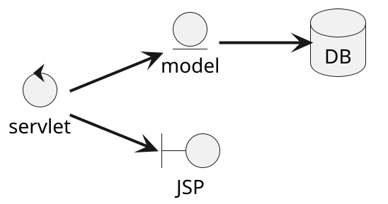
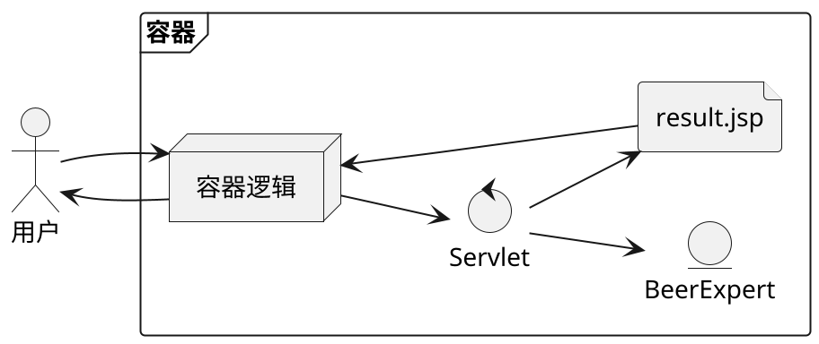
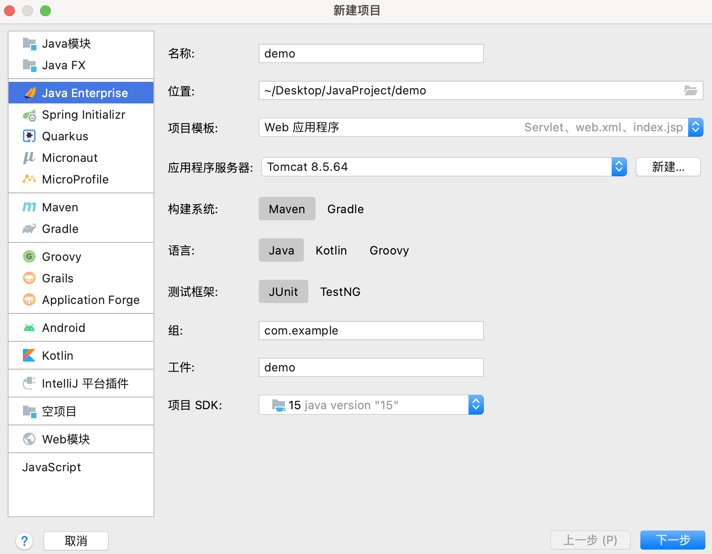
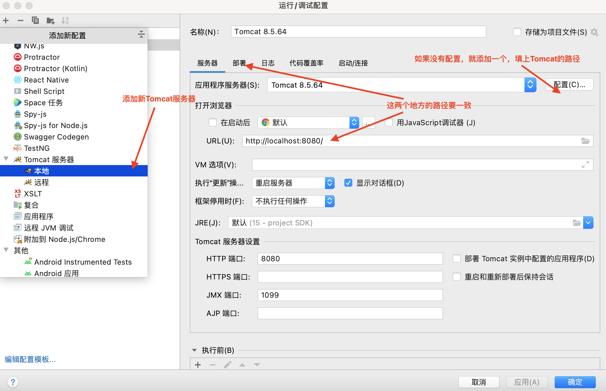

## Web应用体系结构

## 什么是Servlet

Web服务器非常擅长提供静态内容：用户只要请求一个特定的URL，服务器就能马上返回这个内容。但有时候我们需要的不仅是静态内容，比如，你希望你的页面上显示当前的时间，这应该怎么做？这一类页面称为即时页面，即

> 即时页面在请求到来前并不存在，它是在请求到来后，由某个特定辅助程序“当场”写出来的，并由服务器发回给用户。

而Servlet就是这样一个辅助应用。

## 什么是容器

Servlet没有`main()`
方法。它们受控于另一个Java应用，我们称之为容器。比如，Tomcat就是这样一个容器，服务器接收到指向某个Servlet的请求后，并不会直接调用Servlet，而是交给部署了这个Servlet的容器。由容器向Servlet提供请求和响应对象，而且由容器调用Servlet对应的方法，比如`doPost()`
或`doGet()`。

容器可以实现：

* 通信支持。你不必自己建立ServerSocket，监听端口，创建流等一系列工作。这些都交给容器完成，你只需要在Servlet中实现业务逻辑。
* 生命周期管理。容器会负责加载、实例化和初始化Servlet，调用方法，并在不需要时使得它能被垃圾回收。
* 多线程支持。服务器会为每个请求创建一个新的Java线程，自动管理它们的运行。虽然你还是要考虑线程安全问题，但是可以少做很多工作。
* 声明式安全。利用容器，你可以使用XML的形式描述你的安全配置，而不必硬编码到Servlet中。

## MVC模式

MVC模式的全称是模型-视图-控制器模式。业务逻辑不应该放在Servlet中——它应该被放在“模型”里。模型通常是一个可重用的Java类，是业务数据（比如购物车的状态）和处理这些数据的方法（或规则）的组合。MVC模式并不是web应用特有的。事实上，在大部分应用中，将业务逻辑和表示相分离都是非常重要的！



### 教程：创建一个简单的Web应用

1. **需求**：我们的Web应用是一个啤酒顾问。用户访问这个应用，先问一个问题，然后会得到有用的建议。

2. **架构**：虽然它是一个很小的应用，但我们还是要用MVC架构。这样一来，即使以后要扩展它，我们也能从容不迫。



3. **创建开发环境**：此次采用Tomcat@8作为容器，在IntelliJ Idea中进行开发。
    1. 新建Web项目，配置服务器：
       

    2. 创建第一个表单页面的HTML，它只包含一个标题，以及一个选择页面：

       ```html
       <body>
       <h1 class="head">Beer Selection Page</h1>
       <form method="post" action="SelectBeer.do" class="formPost">
           <h2 class="head">Select beer characteristics</h2>
       Color:
       <select name="color" size="1">
           <option value="light">light</option>
           <option value="amber">amber</option>
           <option value="brown">brown</option>
           <option value="dark">dark</option>
       </select>
       <br/><br/>
       <input type="submit" class="submit"/>
       </form>
       </body>
       ```

    3. 编写对应的Servlet

         ```java
   @WebServlet(value = {"/SelectBeer.do"})
   public class BeerSelect extends HttpServlet { @Override protected void doPost(HttpServletRequest req,
   HttpServletResponse resp) throws ServletException, IOException { resp.setContentType("text/html;charset=UTF-8"); var
   out = resp.getWriter(); var color = req.getParameter("color");

                 out.println("<h1>Beer Expert's Suggestion</h1>");
                 for (var beer : new BeerExpert().getBrands(color)) {
                     out.printf("<p>Why not try %s?</p>\n", beer);
                 }
             }
         }
         ```

    4. 编写实体类

         ```java
         public class BeerExpert {
             public List<String> getBrands(String color) {
                 List<String> brands = new ArrayList<>();
                 switch (color) {
                     case "amber" -> {
                         brands.add("Jack Amber");
                         brands.add("Red Moose");
                     }
                     default -> {
                         brands.add("Jail Pale Ale");
                         brands.add("Gout Stout");
                     }
                 }
                 return brands;
             }
         }
         ```

    5. 测试代码

        1. 添加配置

           

        2. 运行服务器

        3. 访问`http://localhost:8080/`

        4. 选择一种啤酒颜色

        5. 如果Servlet正常运行，你将会看到浏览器上的响应为：

             ```html
             Beer Select Advice
             Beer Select brown
             ```

好了，这只是一个快速的开始，真正的内容都在后头呢……