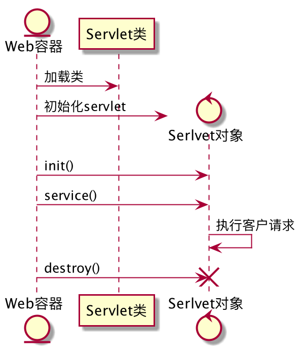
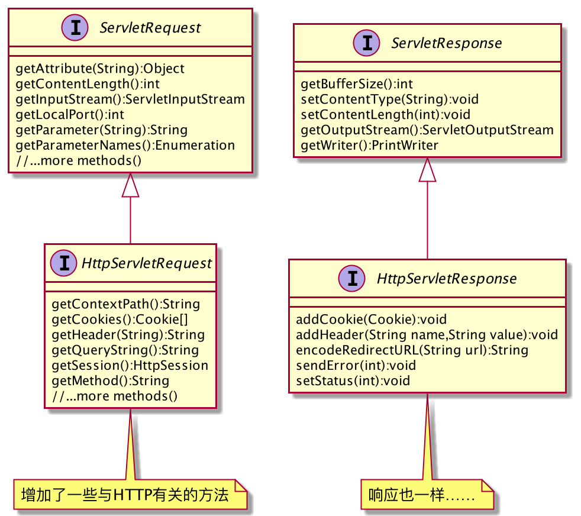

# Servlet 请求和响应

## Servlet生命周期

Servlet的生命周期受容器的控制，通常Servlet的一生会遵循这样的流程：

1. 用户点击链接，URL指向一个Servlet
1. 容器创建对应的对象：
    1. `HttpServletRequest`
    1. `HttpServletResponse`
1. 容器根据URL查找正确的Servlet并为这个请求创建或分配一个线程，并调用Servlet的`service()`方法
1. `service()`方法根据客户端发来的HTTP方法确定要调用哪个servlet方法(`doGet()`,`doPost()`)
1. servlet创建响应对象并写回响应。响应通过容器发送
1. `service()`方法结束，线程要么结束，要么回到容器管理的线程池。请求和响应对象的可以被回收。

其实非常简单。servlet只有一个状态：初始化。一个servlet要么未被`init()`，要么正在被`init()`，要么正在被`destroy()`，或者还不存在。 其生命周期如下图所示：



因此，在它的生命周期中有三个重要时刻：

| 方法 | 何时调用 | 作用 | 是否能被覆盖 |
|-----|---------|-----|------------|
|`init()`|servlet实例被创建后，在能够为客户提供服务前，由容器调用|初始化servlet|有可能。如果你需要初始化（比如连接到数据库或向其他对象注册），你就得覆盖`init()`方法。|
|`service()`|当第一个客户请求到来时，容器分配线程并调用|查看请求、确定HTTP方法并调用对应的servlet方法|不太可能。不应该覆盖此方法。|
|`doGet()`或`doPost()`|由`service()`方法调用|处理业务逻辑|至少要覆盖其中之一，取决于实际业务。如果没有覆盖，就相当于告诉容器该servlet不支持此HTTP方法。|

Servlet以单例模式运行。如果有多个请求到来，每次容器都会创建一个新线程并调用servlet的`service()`方法。通常，有多少请求就有多少线程在运行。 servlet类不会有多个实例，但是**
容器会运行多个线程来处理对一个servlet的多个请求**。对应每个客户请求，都会生成一对新的请求和响应对象。

### 加载和初始化

servlet的加载和初始化由容器完成。服务器启动后，容器会自动寻找已部署的Web应用，并搜索Servlet类文件。此后容器会加载类，至于时机，可能是容器启动时，或者在客户首次使用到这个Servlet时，时机取决于容器的配置。我们要记住的是，在`init()`
方法完成前绝不能运行`service()`方法。

> 通常，`init()`总是在第一个`service()`调用前完成。

创建后的Servlet还只是一个普通对象，而不是一个Servlet。它还需要一些东西来初始化。二者的主要区别就在于Servlet持有两个特定的对象：

1. `ServletConfig` 对象

    * 每个Servlet都持有一个`ServletConfig`对象
    * 用于向servlet传递*部署时信息*，比如数据库或企业bean查找名之类的
    * 用于访问`ServletContext`
    * 通常在部署描述文件中配置

2. `ServletContext` 对象

    * 每个Web应用都持有一个`ServletContext`对象，也叫`AppContext`对象
    * 用于访问Web应用参数
    * 相当于Web应用的公告栏，里面会存放属性，应用的其他部分可以访问
    * 用于得到服务器信息，比如容器名、容器版本、支持的API版本等

## 请求和响应对象

Servlet的请求和响应是通过操作传给它的请求和响应对象来实现的。它们是`service()`方法的参数。



这些类的实现由容器开发商来负责的，它们的具体类型不用你关心，只用知道它们肯定实现了以上接口就行了。

### HTTP方法

客户的请求总是包括一个特定的HTTP方法，如果是GET, 那`service()`就会调用`doGet()`方法；如果是POST, 那就是`doPost()`方法。 HTTP 1.1
协议共规定了8种不同的方法，每种Servlet都有对应的`doXXX()`实现（不过大部分情况下你只会用到GET和POST方法）。

| 方法名  | 作用                                                         |
| ------- | ------------------------------------------------------------ |
| GET     | 得到所请求URL上的某资源                                      |
| POST    | 要求服务器接受附加到请求体的信息，并提供所请求URL上的某资源。POST就像是个扩展版的GET方法 |
| HEAD    | 获取GET返回结果的首部部分                                    |
| TRACE   | 要求请求消息回送，以使客户端能看到服务器接收到的内容         |
| PUT     | 指出要将所包含的信息体放在请求的URL上                        |
| DELETE  | 指出删除所请求URL上的资源                                    |
| OPTIONS | 要求得到所请求URL所能响应的所有HTTP方法                      |
| CONNECT | 请求连接以建立隧道                                           |

### HTTP请求

由于我们主要只会乃至GET和POST方法，因此深入了解这两种方法是很有很必要的。

#### GET和POST辨析

POST和GET方法的根本区别在于，POST有消息体。虽然它们都能发送参数，但GET的参数必须写在请求行上。因此导致了以下区别：

1. 数据大小。POST能发送很大的信息，而GET的参数受限于URL的最大长度。
2. 安全性。GET的参数会显示在浏览器的地址栏内，安全性受限。
3. 书签。GET请求可以用来建立书签，但POST不行。
4. 幂等性。GET请求（按规范）是幂等的，而POST不是。

#### 什么是幂等性？

> A request method is considered "idempotent" if the intended effect on the server of multiple identical requests with that method is the same as the effect for a single such request. Of the request methods defined by this specification, PUT, DELETE, and safe request methods are idempotent.

幂等性意味着一个操作执行多次和执行一次的结果是一样的。这意味着即使发生了多次请求，也不会有**不好**的副作用！按HTTP规范，GET, PUT,
DELETE等方法都是幂等的，但是POST不是。POST提交的数据可能用于不可逆的事务，所以使用时要特别小心。当然，你也可以实现一个非幂等的GET方法……但是客户的GET请求本身是幂等的。

**注意**：幂等只是说明同一个请求可以多次执行得到一样的结果，但并不意味着会得到一样的响应，也不意味着完全没有副作用。

你可以在HTML文件中指定表单以POST形式发送：

```html
<form method="post" action="../SelectBeer.do">
      <b>Select beer characteristics</b>
      Color:
      <select name="color" size="1">
        <option value="light">light</option>
        <option value="amber">amber</option>
        <option value="brown">brown</option>
        <option value="dark">dark</option>
      </select>
  <input type="submit" class="submit" />
 </form>
```

注意，如果你没有指定method的话，默认调用的是GET方法。而你如果又没有在Servlet中覆盖`doGet()`方法的话……那可就麻烦了。也许你会想要同时支持这两个方法。这时你可以只实现`doGet()`方法，然而在`doPost()`
中调用`doGet()`方法。

在Servlet类中，你可以像这样获取参数值：

```java
protected void doGet(HttpServletRequest req, HttpServletResponse resp) throws ServletException, IOException {
        String singleParam = req.getParameter("color");//获取只有一个值的参数
  			String[] sizes = req.getParameterValues("size");//获取可能有多个值的参数
    }
```

除了参数外，你也可以获取许多别的信息，比如`getHeader()`, `getCookies()`, `getSession()`还有`getMethod()`
等。取决于你的需求。如果POST请求的信息体很大，可以使用`getInputStream()`来获取输入流并调用其他对象进行处理。

以下是几个容易弄混的方法：

* `getServerPort()`: 得到请求原来发送到的端口（监听端口）
* `getRemotePort()`: 得到客户的端口
* `getLocalPort()`: 得到请求最后发送到的端口（处理线程的本地端口）

### HTTP响应

响应就是向用户写回信息。通常的使用方法是从响应对象上得到输出流，然后写回HTML或其他内容。大致的步骤是：

1. 首先你需要调用`setContentType()`方法，用于告诉浏览器你要发回什么，以便浏览器做出正确的举止。所谓内容类型，就是MIME类型，它必须被添加到首部。
2. 之后你需要输出内容。你可以选择**字符**或**字节**。ServletResponse接口提供了两个流：
    1. ServletOutputStream: 用于输出字符
    2. PrintWriter: 用于输出字节

> PrintWriter实际上是ServletOutputStream的一个装饰者类，为其添加了更高层的字符友好方法。

响应首部有多种方法可以设置：

| 方法                       | 行为                                                         |
| -------------------------- | ------------------------------------------------------------ |
| req.addHeader("foo","bar") | 为响应增加一个新首部和值，或者问一个现有的首部**增加**另一个值 |
| req.setHeader("foo","bar)  | 如果响应中已有同名的首部，则用新值**覆盖**掉。否则添加一个新首部 |
| req.setIntHeader("foo",42) | 一个便利方法，省得再转换一次                                 |

### 重定向

有时候你可能需要定位到另一个URL, 或者分派给另一个web应用。这时你可以使用重定向方法：

```java
if(workForMe){//handle it}
else response.sendRedirect("http://www.java.com")
```

如果使用相对URL, 容器也会自动建立完整的URL。相对URL有两种形式：以"/"开头和不以"/"开关。

* 不以"/"开头：比如"foo/stuff.html"。容器会基于当前URL建立完整URL: `www.xxx.com/myApp/cool/foo/stuff.html`
* 以"/"开头：比如"/foo/stuff.html"。容器会基于web应用本身建立完整URL: `www.xxx.com/foo/stuff.html`

注意：如果写入响应后，再调用重定向方法就会抛出`IllegalStateException`异常。重定向和请求分派并不相同。重定向是servlet完成，而请求分派是由容器完成。
