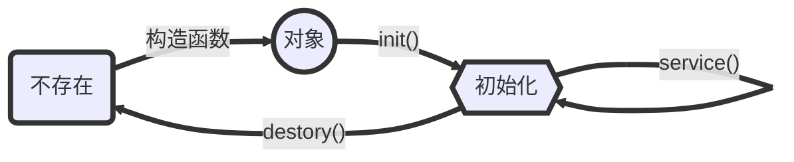
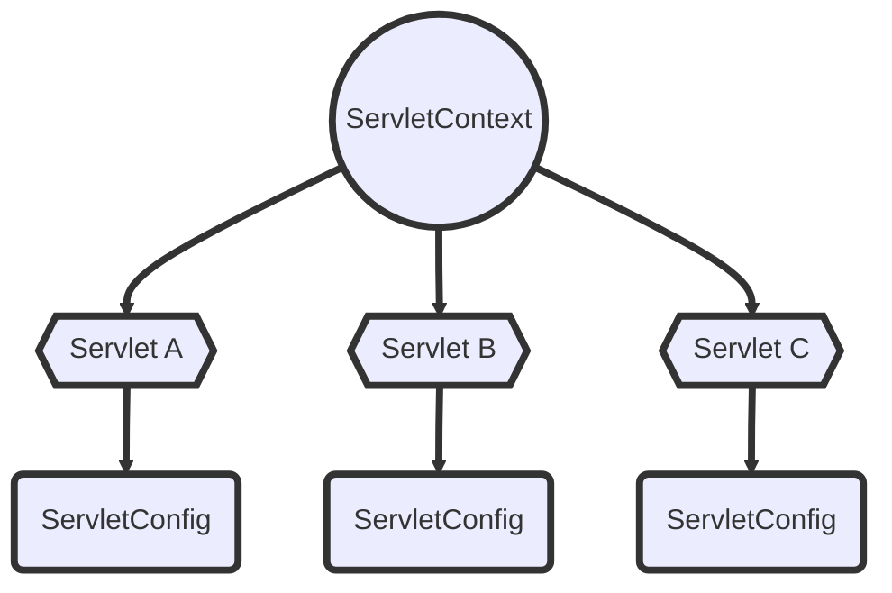
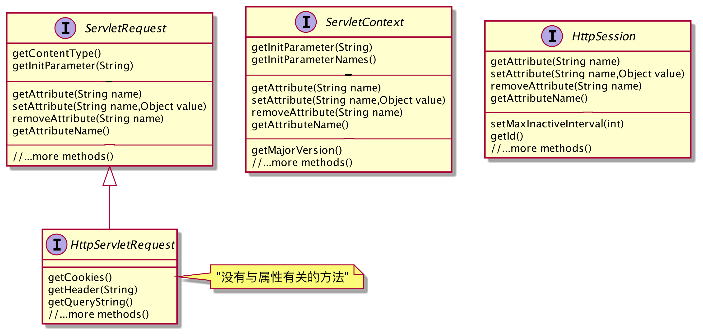

# 属性和监听者

设想你想在web应用中设置一些初始值（比如，你的Email地址），但是你又不想硬编码到代码中。最佳解决方案可能是编写到描述文件(web.xml)里。我们知道Servlet可以接受请求参数，不过Servlet还可以有初始化参数。

## Servlet初始化参数

回顾一下Servlet的初始化过程：首先由容器创建Servlet对象，然后为它运行`init()`方法初始化。事实上，容器会在初始化的时候为它创建一个唯一的`ServletConfig`
，并从描述文件中取出Servlet初始化参数，交给`ServletConfig`，并由`ServletConfig`传递给`init()`方法。



`init()`方法有两个重载版本：有参和无参。通常，继承而来的`init(ServletConfig)`方法会调用`init()`方法，所以在自己实现中只要覆盖无参版本的`init()`方法即可。Servlet只能在`init()`
方法中读取初始化参数，即容器初始化的时候——容器会为`ServletCnfig`生成对应的键值对。这意味着在在容器初始化完成后就不能再读取初始化参数了，除非**重新部署容器**。

在web.xml中添加初始化参数：

```xml
<!--    xml方式实现Servlet初始化参数-->
<servlet>
    <servlet-name>Email</servlet-name>
    <servlet-class>Chapter5.GetEmail</servlet-class>
    <init-param>
        <param-name>adminEmail</param-name>
        <param-value>blooper@icloud.com</param-value>
    </init-param>
</servlet>
<servlet-mapping>
<servlet-name>Email</servlet-name>
<url-pattern>/email</url-pattern>
</servlet-mapping>
```

或者直接编写Servlet类：

```java

@WebServlet(value = "/email", initParams = {@WebInitParam(name = "adminEmail", value = "blooper@icloud.com")})
public class GetEmail extends HttpServlet {
    @Override
    protected void doGet(HttpServletRequest req, HttpServletResponse resp) throws ServletException, IOException {
        String email = getServletContext().getInitParameter("adminEmail");
        resp.getWriter().printf("<html><body><p>%s</p></body></html>", email);
    }
}
```

然后测试一下：


## 上下文初始化参数

但是`ServletConfig`有一个问题：它只能用于特定的Servlet。如果你的参数只用于特定的页面，你可以给`HttpServletRequest`
设置属性并转发给特定页面。但是如果你的参数需要web应用中的所有成员都能访问到该怎么办？

一种解决方案是让某个Servlet读取`ServletConfig`参数并保存在某个地方。但是这是不行的，你无法确定哪个Servlet会被容器先初始化。不能依赖于Servlet的初始化顺序，这是不确定的。绝对不能这样。

正确的解决方案是使用**上下文初始化参数**。它和Servlet初始化参数很像，但作用域是全web应用，而不是某个特定的Servlet。这意味着我们只要配置好全局参数，web应用中的所有Servlet就都可以访问到了！

记住：每个Servlet都有一个`ServletConfig`，一个web应用只有一个`ServletContext`。不过，如果是分布式Web应用，则每个JVM都有一个`ServletContext`。通常这对开发者而言是透明的。



有两种方式可以获得`ServletCotext`，即使用`getServletConfig().getServletContext().getInitParameter()`
和`getServletContext().getInitParameter()`方法。这是由于每个`ServletConfig`都持有该Servlet的`ServletConfig`
的一个引用。如果在一个非Servlet类中，可以传递自身的`ServletConfig`引用来获取`ServletContext`。

最后回顾一下上下文参数和Servlet参数的异同：

| 阶段         | 上下文初始化参数                                   | Servlet初始化参数                             |
| ------------ | -------------------------------------------------- | --------------------------------------------- |
| 部署描述文件 | 在`<web-app>`元素中，但不在特定的`<servlet>`元素里 | 在特定的`<servlet>`元素里                     |
| Servlet代码  | `getServletContext().getInitParameter("foo");`     | `getServletConfig().getInitParameter("foo");` |
| 作用域       | 对所有的Servlet可见                                | 对指定了初始化参数的Servlet可见               |

## ServletContextListener 监听者

上下文参数只能是String。但是如果你需要让Web应用的所有部件都能访问一个特定的类怎么办呢？比如说，一个数据库连接？你可以把这个数据库连接的查找名放在上下文初始化参数里，但是由谁来把这个String参数转换为具体的DataSource引用呢？和之前一样，你绝不能把这个工作交给某个特定的Servlet完成。

你需要的是一个监听者类，它可以在：

* 在上下文初始化的时候得到通知

    * 从ServletContext得到必要的初始化参数
    * 使用这个参数建立具体的数据库连接
    * 将该连接对象的引用存储为一个属性，使得所有的Web应用都可以访问

* 上下文撤消（应用结束）的时候得到通知：

    * 关闭数据库连接

### 教程：一个简单的ServletContextListener

接下来是一段简单的教程，我们建立一个`Dog`类，它的品种由上下文初始化参数指定。我们用`ServletContextListener`读取其品种，并实例化相应的`Dog`
对象，写入上下文属性中，然后由某个没有读取上下文参数的Servlet访问并打印出来。

1. 建立和使用一个上下文监听者

    1. 创建一个监听者类

       ```java
       @WebListener
       public class MyServletContextListener implements ServletContextListener {
           @Override
           public void contextInitialized(ServletContextEvent sce) {
               var context = sce.getServletContext();
               String dogBreed = context.getInitParameter("dogBreed");
               Dog littleDog = new Dog(dogBreed);
               context.setAttribute("dog",littleDog);
               System.out.println("Binding dog complete!");
           }
       }
       ```

    2. 如果没有使用注解，就要在web.xml中指出：

       ```xml
        <!--    xml设置监听者-->
        <listener>
      	    <listener-class>Chapter6.MyServletContextListener</listener-class>
        </listener>
        ```

2. 编写属性类

   ```java
   public class Dog{
       private final String breed;
   
       public Dog(String breed) {this.breed = breed;}
       public String getBreed() {return breed;}
       @Override
       public String toString() {
           return "Dog{" +"breed='" + breed + '\'' + '}';
       }
   }
   ```

3. 编写测试Servlet类

   ```java
   @WebServlet("/dog")
   public class dogServlet extends HttpServlet {
       @Override
       protected void doGet(HttpServletRequest req, HttpServletResponse resp) throws ServletException, IOException {
           Dog dog = (Dog) this.getServletContext().getAttribute("dog");
           resp.getWriter().printf("this is my <b>%s</b>!",dog);
       }
   }
   ```

4. 在xml中添加上下文初始化参数

   ```xml
   <context-param>
     <param-name>dogBreed</param-name>
     <param-value>Beagle</param-value>
   </context-param>
   ```

在这过程中有几点需要注意：

* Servlet属性最好是可序列化的。由于我运行的并不是一个分布式web应用，所以没有实现序列化。但在实践中最好序列化。
* `getAttribute()`方法返回的是`Object`, 需要强制转换为需要的对象。
* 如果没有使用注解，记得在xml中添加必要的类。

### 监听者类

除了ServletContextListener外，还有其他7种不同的监听者。它们具有以下作用：

| 场景                                             | 接口                              | 事件                           |
| ------------------------------------------------ | --------------------------------- | ------------------------------ |
| 你想要web应用上下文是否增/删/改了一个属性        | `ServletContextAttributeListener` | `ServletContextAttributeEvent` |
| 你想要跟踪活动的会话（比如，知道有多少并发用户） | `HttpSessionListener`             | `HttpSessionEvent`             |
| 你想在每次请求到来时都知道，以便记录日志         | `ServletRequestListener`          | `ServletRequestEvent`          |
| 增/删/改请求属性时获得通知                       | `ServletRequestAttributeListener` | `ServletRequestAttributeEvent` |
| 让属性类被绑定到某个会话（或被删除时）获得通知   | `HttpSessionBindingListener`      | `HttpSessionBindingEvent`      |
| 增/删/改某个会话属性时获得通知                   | `HttpSessionAttributeListener`    | **`HttpSessionBindingEvent`**  |
| 你想知道是否创建或撤消了一个上下文               | `ServletContextListener`          | `ServletContextEvent`          |
| 让属性类在其被绑定的会话迁移到其他JVM时获得通知  | `HttpSessionActivationListener`   | **`HttpSessionEvent`**         |

其中，`HttpSessionBindingListener`通常是由属性类来实现接口。它不需要在注解或xml文件中声明。

## 属性

属性就好像是钉到公告板上的一个对象。有人在公告栏上贴布告，以便其他人能够看到。你可以简单的认为它是一个映射实例对象的键值对(`String` - `Object`对)。实际上，它是一个对象，可以绑定到`ServletContext`
, `HttpServletRequest`
或`HttpSession`中的一个上。属性和参数的主要区别在于：

* 属性可以修改，参数不能修改
* 属性返回对象，参数返回String

### 作用域

三种属性，三种作用域：

| 作用域 | 可访问性 | 生命期 | 适用于 |
| :--- | :------- | :----- | :----- |
|上下文属性|应用中的所有部分都能访问        | 相当于所部署应用的生命期。服务器关闭时上下文撤消 | 需要整个应用共享的资源。如数据库连接 |
|会话属性|能访问该Session的部分可以访问|会话的生命期。会话可以手动撤消，也可能因为超时撤消|与客户会话有关的资源。比如购物车|
|请求属性|能访问该ServletRequest的部分可以访问|请求的生命期。持续到Servlet的`service()`方法结束|将模型信息从控制器传到视图……或特定于客户请求的任何数据|

值得注意的是，三种属性作用域中对应属性的接口完全相同：

```java
Object getAttribute(String name);
void setAttribute(String name,Object value);
void removeAttribute(String name);
Enumeration getAttributeName();
```

具体的类图如下：


### 线程安全的属性

**上下文属性**
：上下文属性不是线程安全的。由于请求是并发处理的，因此可能同时有多个线程、甚至多个Servlet访问同一个上下文属性。要命名得上下文属性受到保护，同步Servlet中的响应请求方法肯定是不行的——可能同时有多个Servlet访问！正确的做法是对所有访问上下文属性的操作加锁：

```java
public class SynchronizedServlet extends HttpServlet {
    @Override protected void doGet(HttpServletRequest req, HttpServletResponse resp) throws ServletException, IOException {
        PrintWriter out = resp.getWriter();
        synchronized (getServletContext()){
            getServletContext().setAttribute("foo",42);
            out.println(getServletContext().getAttribute("foo"));
        }
    }
}
```

**会话属性**
：会话属性不是线程安全的。会话是与客户绑定的，理论上说在给定任意时刻，一个特定客户只有一个请求，所以会话属性可能是线程安全的……但是客户可能会在同时发起多个请求，比如打开多个浏览器窗口访问同一个网站。因此，同样需要对`HttpSession`
进行同步：

```java
public class SynchronizedServlet extends HttpServlet {
    @Override protected void doGet(HttpServletRequest req, HttpServletResponse resp) throws ServletException, IOException {
        PrintWriter out = resp.getWriter();
      	HttpSession session = req.getSession();
        synchronized (session){
            session.setAttribute("foo",42);
            out.println(session.getAttribute("foo"));
        }
    }
}
```

**请求属性和局部变量**：线程安全。所有的实例变量都可能是线程不安全的，只有局部变量是。

### RequestDispatcher

如果你需要让应用的其他部分接管部分（或者全部）请求，可以使用请求属性，并使用请求分派把请求转发给那个部分。举个例子，控制器与模型通信获取了一些数据，并将它发给视图，但是这些属性显然不应该放在上下文或者会话属性中，这时就可以使用请求属性：

```java
result = model.get();
request.setAttribute("style",result);

RequestDispatcher view = request.getRequestDispatcher("result.jsp");
view.forward(request,response); 	//告诉组件接管请求
```

`RequestDispatcher`有两个方法：`forward()`和`include()`，不过主要是用`forward()`方法。

> 注意：如果已经提交了响应，就不能再转发请求了！