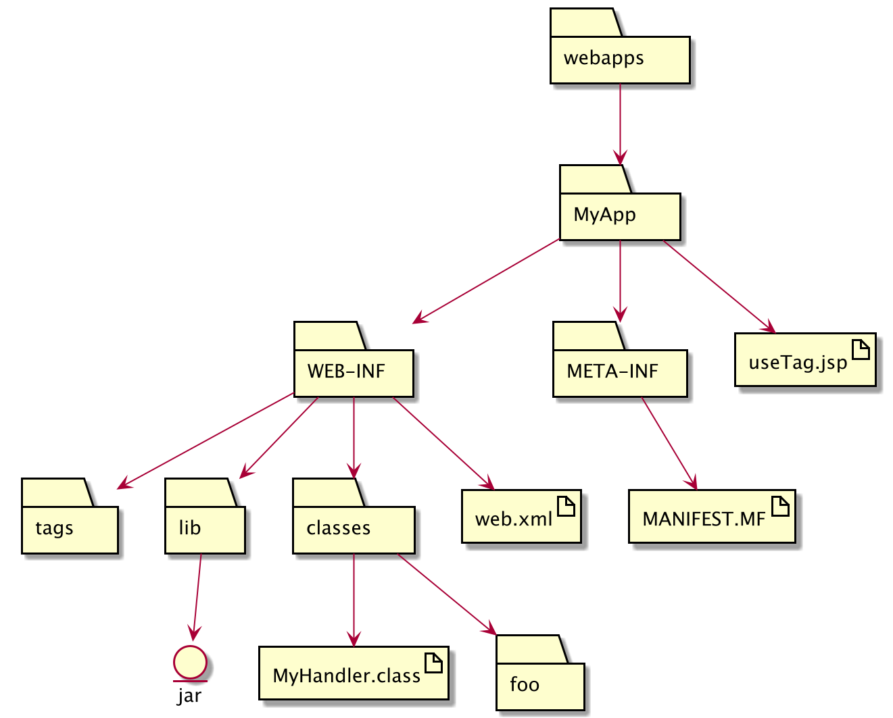

# 部署web应用

## 目录结构

web应用的目录结构要求非常严格，因此移动一个web应用是很麻烦的。

我们知道java应用可以被部署为jar文件。web应用也能被这样部署为war文件，是WebArchive的缩写。它的结构和jar文件有相似之处：



war文件就是web应用的一个快照。它采用了一种更具有可移植性的压缩格式，本质上就是将web应用的所有内容压缩起来，并指定为war拓展名。至于其上下文，通常取决于容器。例如，在Tomcat中，war文件的文件名就是web应用名。
war文件的另一个好处是可以声明库依赖性。你可以在war文件的META-INF/MANIFEST.MF文件中声明库依赖，这样一来在部署时就能检查容器中是否有依赖的包和类，避免到了用户请求时才发现没有资源的尴尬。

部署静态页面时，如果不放在META-INF文件夹下，就能从外部直接访问。类似的，如果放在META-INF路径下，就不能从外界直接访问。不过，这儿的资源可以为应用内部的类或者文件访问，也可以用来转发。顺便一提，WEB-INF也具有同样的特征。直接访问WEB-INF路径下的任意文件都会得到一个404错误。

## Servlet 映射

每个Servlet映射都由两部分组成，`<servlet>`元素定义一个servlet名和类，而`<servlet-mapping>`
则定义映射到这个servlet的URL模式。这个URL模式可能是虚拟的，它包括真实的物理结构和虚拟的逻辑结构。

1. 完全匹配

   ```xml
   <url-pattern>/Beer/Select.do</url-pattern>
   ```

2. 目录匹配

   ```xml
   <url-pattern>/Beer/*</url-pattern>
   ```

3. 扩展名匹配

   ```xml
   <url-pattern>*.do</url-pattern>
   ```

   其查找顺序如上所述，即先查找完全匹配，然后在对应的目录查找，最后尝试拓展名匹配。如果一个请求与多个URL模式匹配，则容器会选择最长的匹配，或者说最特定的匹配。

## 配置欢迎/错误页面

你可以在用户请求特定文件夹时指定其默认的HTML文件。注意，此处指定的是文件名，一定不要在前面加`/`。

```xml
<welcome-file-list>
	<welcome-file>index.html</welcome-file>
  <welcom-file>default.jsp</welcom-file>
</welcome-file-list>
```

当用户访问特定文件夹时，容器会依以下顺序操作：

1. 查找servlet映射
2. 如果没有，则尝试在该目录下查找`index.html`
3. 如果没有，则尝试在该目录下查找`default.jsp`
4. 查找成功则向用户返回该响应

类似地，你可以配置错误页面：

* 配置通用错误页面

```xml
<error-page>
	<exception-type>java.lang.Throwable</exception-type>
  <location>/errorPage.html</location>
</error-page>
```

* 为特定错误配置错误页面

```xml
<error-page>
	<exception-type>java.lang.ArithmeticException</exception-type>
  <location>/ArithmeticErrorPage.html</location>
</error-page>
```

* 为特定HTTP状态码配置错误页面

```xml
<error-page>
	<error-code>404</error-code>
  <location>/NotFoundError.html</location>
</error-page>
```

最后，你还可以手动指定哪些servlet要在容器部署时初始化，并指定它们的顺序：

```xml
<servlet>
	<servlet-name>foo</servlet-name>
  <servlet-class>Test.Foo</servlet-class>
  <load-on-startup>1</load-on-startup>
</servlet>
```

对于`<load-on-startup>`属性，只要为非负，就会在部署时加载，其顺序取决于其具体值。值越大，加载时排在越后面。