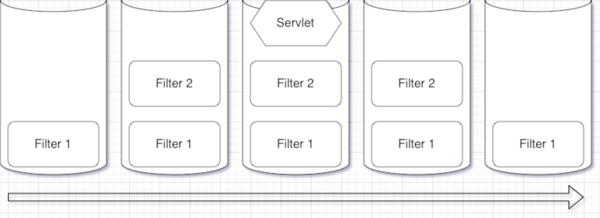

# 过滤器和包装器

你可能会有这样的需求：针对所有不同的用户交互，跟踪它们的运转情况。你可不能去修改所有的Servlet！比较好的做法是，来个“过滤器”：

## 过滤器

过滤器也是Java组件之一，它可以在请求发送前截获和处理请求。此外，Servlet工作结束后，也可以用过滤器来读取响应，做一些相关的事情。容器会依据web.xml中的声明来确定何时调用过滤器。

请求过滤器可以：

* 完成安全检查
* 重新格式化请求体或首部
* 建立请求日志

响应过滤器可以：

* 压缩响应流
* 追加或修改响应流
* 创建一个不同的响应流

过滤器和Servlet的基本工作流如下：


过滤器是完全模块化的。你可以在web.xml中链接多个过滤器，指定它们的顺序，一个接一个的运行。它们是完全自包含的，没有显式的依赖关系。（当然，业务逻辑是另一码事了）

从设计上说，其实过滤器和Servlet是非常像的：

* 容器处理过滤器API。一旦你为某个类实现了`Filter`接口，它就能和Servlet一样，访问`ServletContext`，也可以与其他过滤器链接。
* 容器处理过滤器的生命周期。过滤器也有类似servlet的生命周期，如`init()`和`destroy()`方法。事实上，过滤器也是由容器初始化调用`init()`方法，每次应用过滤器时调用`doFilter()`
  方法，并在被删除时调用`destroy()`方法。这一点和Servlet是完全一致的。
* web应用可以有多个过滤器。针对要运行的过滤器，以及其顺序，都需要在web.xml中指明（或注解）。

### 示例：建立请求跟踪过滤器

这次的任务是，每当有用户请求和更新啤酒相关的任何资源时，就记录是谁做出的请求。下面是一个这样的过滤器实现：

```java
@WebFilter(urlPatterns = {"*.do"}, dispatcherTypes = DispatcherType.REQUEST)
public class BeerRequestFilter implements Filter { //每个过滤器都必须实现Filter接口
    FilterConfig filterConfig;
    @Override
    public void init(FilterConfig filterConfig) throws ServletException {
        this.filterConfig=filterConfig; //必须实现init()方法。通常只用保存filterConfig即可
    }
    @Override
    public void doFilter(ServletRequest request, ServletResponse response, FilterChain chain) throws IOException, ServletException {
        HttpServletRequest httpReq = (HttpServletRequest) request; //注意此处需要强转
        String name = httpReq.getRemoteUser();
        if(name!=null){
            System.out.println("User "+name+" is updating!");
            filterConfig.getServletContext().log("User "+name+" is updating!");
        }else{
            System.out.println("no name user is updating");
        }
        chain.doFilter(request,response); //调用过滤器链的下一个对象
        //此方法并非this.doFilter，而是FilterChain对象上的同名方法
    }
    @Override
    public void destroy() {
        //完成清理工作
    }
}
```

### 过滤器的调用过程

虽然Servlet规范并未指定容器中如何处理调用过程，不过实际上可以把它们视作栈上的方法调用。当然，具体过程复杂得多，不过在概念上我们可以作如下设想：



首先，容器发现这个servlet响应需要过滤，于是调用filter1的`doFilter()`方法。这个方法处理完成后将请求和响应发送给过滤器链上的下一个过滤器。这个过滤器也调用其`doFilter()`
方法，来到链尾，调用Servlet的`service()`方法。此后，servlet的调用完成出栈，控制权回到filter2上。filter2完成其尚未完成的`doFilter()`
方法，完成后出栈，最后回到filter1。在filter1也完成后，响应结束。

过滤器在web.xml中的配置的规则如下：

* 必须要有`<filter-name>`
* 必须有`<filter-class>`
* `<init-param>`可以有0或多个
* 必须有`<url-pattern>`或`<servlet-name>`其中之一
* 可以有0~4个`<dispatcher>`元素，默认为`REQUEST`
    * `INCLUDE`表示对由`include()`转发的请求启用过滤器
    * `FORWARD`表示对由`forward()`转发的请求启用过滤器
    * `ERROR`表示对错误处理器调用的资源启用过滤器

以下是一段示例，注解中同样适用这些规则：

```xml
<!--    声明过滤器-->
    <filter>
        <filter-name>BeerRequestFilter</filter-name>
        <filter-class>Chapter12.BeerRequestFilter</filter-class>
        <init-param>
            <param-name>LogFileName</param-name>
            <param-value>UserLog.txt</param-value>
        </init-param>
    </filter>
<!--    声明对应URL模式的过滤器映射-->
    <filter-mapping>
        <filter-name>BeerRequestFilter</filter-name>
        <url-pattern>*.do</url-pattern>
<!--        声明应用于请求分派器的模式-->
        <dispatcher>REQUEST</dispatcher>
    </filter-mapping>
<!--    声明对应Servlet名的过滤器映射-->
    <filter-mapping>
        <filter-name>BeerRequestFilter</filter-name>
        <servlet-name>ch1Servlet</servlet-name>
    </filter-mapping>
```

## 示例：用一个响应过滤器压缩输出流

目标：实现一个响应过滤器，它能在响应发送到用户之前对响应进行压缩。 参考我们之前的的概念调用栈，显然不存在有在servlet后面的过滤器。不过servlet发送响应后会被从栈中弹出，这时还会有机会执行过滤器！于是我们很容易就能写出伪代码：

```java
import javax.servlet.*;
class MyCompressionFilter implements Filter {
    @Override
    public void doFilter(ServletRequest request, ServletResponse response, FilterChain chain){
        //处理请求
        chain.doFilter(request,response);
        //处理压缩逻辑
    }
}
```

### 真的这么简单吗？

编写好程序后实际运行一下，就会发现输出流并没有被压缩。为什么会这样呢？让我们仔细地再看一下调用过程：


没错，问题在于，servlet调用响应对象的输出流写回后，就直接写回给用户了！过滤器没能来得及先对输出做处理。问题来了，要怎么对输出做处理呢？

### 包装器

servlet实际上是从响应对象上获取输出流的。那么，如果我们传给servlet的不是原始的`HttpServletResponse`对象，而是一个**定制**后的响应对象，它能自动完成压缩工作……这样不就行了吗？
我们在这里可以使用装饰器模式，让过滤器传给servlet一个经过包装的响应。大部分调用都委托给原本的`HttpServletResponse`对象，只要输出流需要定制。这样一来，就能控制servlet的写回输出流过程！

不过还有一个问题：`HttpServletResponse`接口太复杂了！难道要全部实现吗？当然不： java提供了一组包装器类，它实现了几乎所有方法。如果你只需要覆盖其中某些方法，只要继承自包装器并重写你需要的方法就可以了。一共有四个"
便利"包装类：

* `ServletRequestWrapper`
* `HttpServletRequestWrapper`
* `ServletResponseWrapper`
* `HttpServletResponseWrapper`

包装器的作用：包装了实际的请求或响应对象，并把相应的方法调用传给实际对象，还允许你定制请求/响应要做的额外处理。

### 实现

最后是编码工作。 首先是实现压缩过滤器：

```java
import java.util.zip.GZIPOutputStream;

@WebFilter(urlPatterns = "*.do")
public class CompressionFilter implements Filter {
  private ServletContext context;
  private FilterConfig config;
  @Override public void doFilter(ServletRequest req, ServletResponse resp, FilterChain chain) throws IOException, ServletException {
    HttpServletRequest request = (HttpServletRequest) req;
    HttpServletResponse response = (HttpServletResponse) resp;
    String validEncoding = request.getHeader("Accept-Encoding");//判断客户是否接受压缩
    if (validEncoding != null && validEncoding.contains("gzip")) {//如果是，则是用压缩包装器包装响应对象
      CompressionResponseWrapper wrapResp = new CompressionResponseWrapper(response);
      wrapResp.setHeader("Content-Encoding", "gzip");
      chain.doFilter(request, wrapResp);
      GZIPOutputStream gos = wrapResp.getGZipOutputStream();
      gos.finish(); //刷新缓冲区
      System.out.println("encoding " + config.getFilterName());
    } else {//否则什么也不做
      System.out.println("Can't encoding!" + config.getFilterName());
      chain.doFilter(request, response);
    }
  }
  @Override public void init(FilterConfig filterConfig) throws ServletException {
    //保存必要的配置对象
    this.config = filterConfig;
    this.context = filterConfig.getServletContext();
  }
  @Override public void destroy() {
    this.config = null;
    this.context = null;
  }
}
```

然后实现压缩流装饰器：

```java
public class CompressionResponseWrapper extends HttpServletResponseWrapper {
    private GZIPServletOutputStream servletGzipOS = null;
    private PrintWriter printWriter = null;
    private Object streamUsed=null;
    public CompressionResponseWrapper(HttpServletResponse response) {
        super(response);
    }
    @Override
    public void setContentLength(int len) { }
    public GZIPOutputStream getGZipOutputStream() throws IOException{
        return this.servletGzipOS.internalGzipOS;
    }
    @Override
    public ServletOutputStream getOutputStream() throws IOException {
        if(streamUsed!=null && streamUsed!=printWriter)throw new IllegalStateException();
        if(servletGzipOS==null){
            servletGzipOS=new GZIPServletOutputStream(getResponse().getOutputStream());
            streamUsed=servletGzipOS;
        }
        return servletGzipOS;
    }
    @Override
    public PrintWriter getWriter() throws IOException {
        if(streamUsed!=null && streamUsed!=servletGzipOS)throw new IllegalStateException();
        if(printWriter==null){
            printWriter=new PrintWriter(
                    new OutputStreamWriter(
                            new GZIPServletOutputStream(getResponse().getOutputStream())
                            ,getResponse().getCharacterEncoding()
                    )
            );
            streamUsed=printWriter;
        }
        return printWriter;
    }
}
```

最后实现辅助类：你只用实现`write()`方法。

```java
public class GZIPServletOutputStream extends ServletOutputStream {
    GZIPOutputStream internalGzipOS;
    public GZIPServletOutputStream(ServletOutputStream outputStream) throws IOException {
        this.internalGzipOS = new GZIPOutputStream(outputStream);
    }
    @Override public void write(int b) throws IOException { internalGzipOS.write(b); }
    @Override public boolean isReady() { return true; }
    @Override public void setWriteListener(WriteListener writeListener) { }
}
```

就这样，你实现了输出流的压缩！